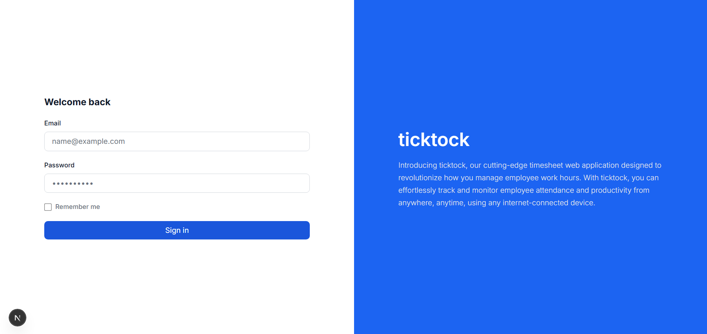
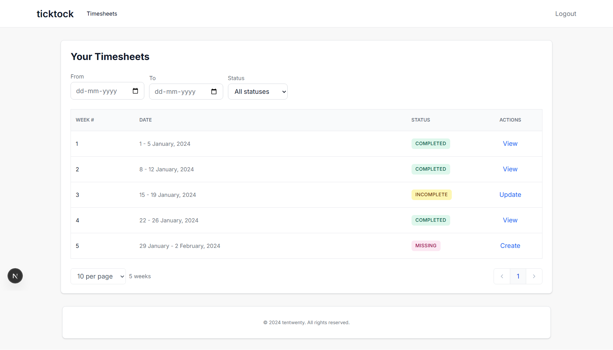
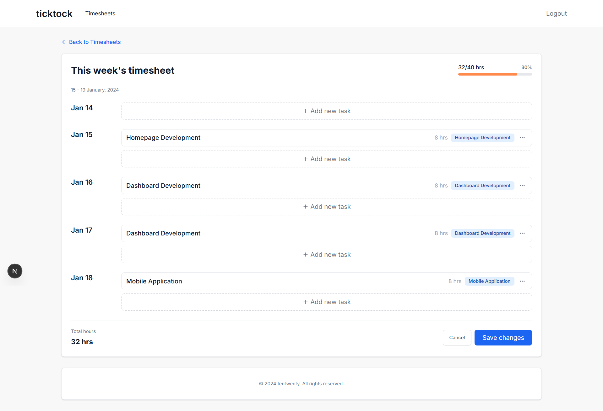
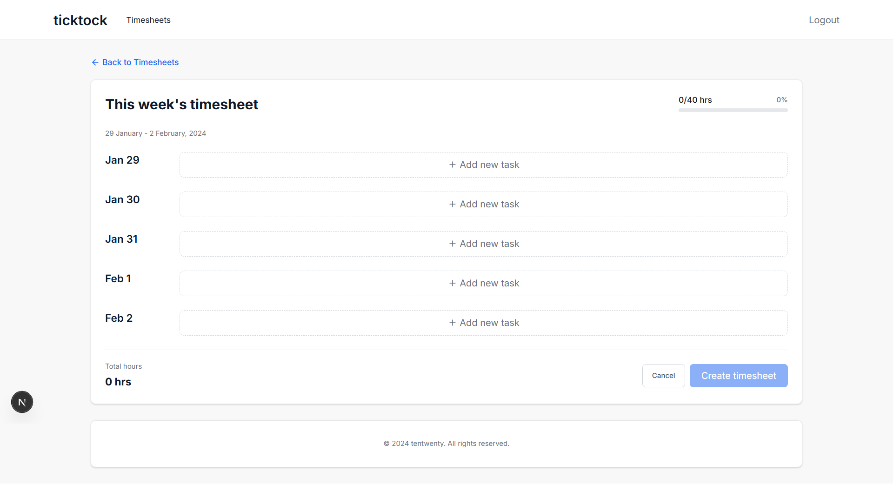
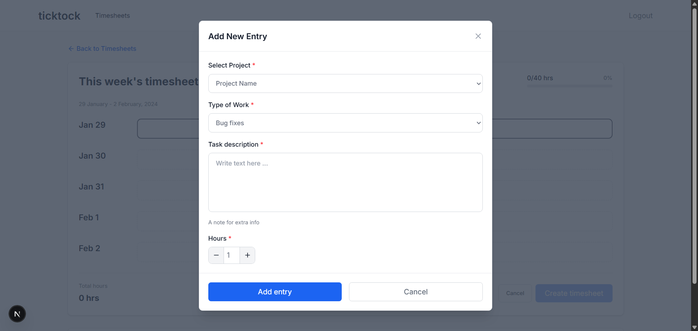

# ticktock | Timesheets

## Overview

ticktock | Timesheets is a SaaS-style Timesheet Management application built as part of the Tentwenty Front-end Developer Technical Assessment. It provides a dummy authenticated workflow for viewing, filtering, creating, and updating weekly timesheets using mocked in-memory data.

**Live demo:** [https://ticktock-jade.vercel.app](https://ticktock-jade.vercel.app)

## Application Flow

1. Sign in at `/login` with the configured demo credentials.
2. Browse the dashboard, filter by date or status, and use pagination to navigate the timesheet list.
3. Choose an action based on the timesheet status:
   - **Completed**: view the submitted entries and weekly total.
   - **Incomplete**: update existing entries, then save the timesheet.
   - **Missing**: create a timesheet by adding one or more entries.
4. In the editor, add tasks by day; edit or delete entries as needed. Each entry requires a project, work type, description, date, and 1-24 hours.
5. Review the live total and progress indicator. Saving at 40 or more hours marks the timesheet as completed; otherwise it remains incomplete.
6. Receive success or error feedback through inline messages and toast notifications, then return to the dashboard.

### 1. Sign in



### 2. Dashboard

The dashboard shows the available weeks, their status, filtering controls, and pagination. It routes completed, incomplete, and missing timesheets to the appropriate action.


### 3. View a completed timesheet

Completed timesheets are read-only and display the weekly metadata, total hours, and submitted entries.



### 4. Update an incomplete timesheet

Incomplete timesheets can be updated. The editor groups entries by date and tracks progress toward the 40-hour weekly target.



### 5. Create a missing timesheet

Missing weeks start with no entries and can be created through the same day-by-day entry workflow.



### 6. Add a timesheet entry

The entry dialog validates required values and keeps each entry between 1 and 24 hours. Existing entries can also be edited or deleted.



## Features

- Dummy credentials authentication with NextAuth, including sign-in and sign-out
- Timesheet dashboard with a paginated listing
- Status and date-range filtering, with an empty state for no results
- View completed timesheets and their entries
- Update incomplete timesheets and create missing timesheets
- Add, edit, and delete timesheet entries with deletion confirmation
- Hours totals and progress toward a 40-hour weekly target
- Client- and API-side validation for required fields and valid entry hours
- Loading and skeleton states, error feedback, and toast notifications
- Responsive layouts, labelled controls, semantic dialogs, and live-region toast announcements
- Application-level error and not-found boundaries
- Unit and component tests with Jest and React Testing Library

## Tech Stack

| Category | Technology |
| --- | --- |
| Framework | Next.js 16 (App Router) |
| Language | TypeScript |
| Styling | Tailwind CSS 4 |
| Authentication | NextAuth.js (Credentials provider, JWT sessions) |
| Forms/Validation | Native React forms and custom validation |
| Testing | Jest, React Testing Library, and `@testing-library/user-event` |
| Icons | lucide-react |
| Package manager | npm |

## Project Structure

```text
src/
├── app/
│   ├── api/
│   │   ├── auth/
│   │   ├── projects/
│   │   └── timesheets/
│   ├── dashboard/
│   │   └── timesheets/
│   └── login/
│
├── components/
│   ├── auth/
│   ├── layout/
│   ├── timesheets/
│   └── ui/
│
├── lib/
│   ├── api/
│   ├── mock-data/
│   ├── utils/
│   └── validations/
│
└── types/

## Getting Started

### Prerequisites

- Node.js
- npm

### Installation

```bash
git clone <repository-url>
cd timesheet-management
npm install
```

### Environment variables

Create a `.env.local` file in the project root and provide the dummy credentials used by the NextAuth Credentials provider:

```env
DEMO_EMAIL=ticktock@gmail.com
DEMO_PASSWORD=123456789
NEXTAUTH_SECRET=timesheet-management-development-secret-change-this
```

### Run locally

```bash
npm run dev
```

Open [http://localhost:3000](http://localhost:3000), then sign in with the `DEMO_EMAIL` and `DEMO_PASSWORD` values configured above.

### Test and build

```bash
npm test
npm run build
```

## Assumptions and Notes

- The application uses mocked, in-memory timesheet and project data for this assessment; changes are not persisted after a server restart.
- The NextAuth Credentials provider validates the email and password against `DEMO_EMAIL` and `DEMO_PASSWORD`.
- A weekly total of 40 hours or more changes a saved missing or incomplete timesheet to **completed**.
- React Hook Form and Zod are installed but are not used by the current implementation; validation is handled with native React form controls and custom logic.

## Time Spent

Approximately 12 hours, including implementation, responsive UI work, test coverage, documentation, and screenshot capture.
